# Vietnamy — Full Architecture (for Mobile Developers)

> **Audience:** mobile devs porting Vietnamy to native (React Native, Flutter, or Swift/Kotlin).
> **What this is:** the complete architecture, each chart embedded below **and** available as a standalone `.mermaid` file in this folder (so you can open, edit, or export any single diagram).
> Renders in Obsidian (Mermaid core plugin), GitHub, and most Markdown tools.

## Diagram index

| # | Diagram | File |
|---|---------|------|
| 1 | System context | [`01-system-context.mermaid`](01-system-context.mermaid) |
| 2 | Frontend layers | [`02-frontend-layers.mermaid`](02-frontend-layers.mermaid) |
| 3 | State ↔ storage map | [`03-state-storage.mermaid`](03-state-storage.mermaid) |
| 4 | Content pipeline | [`04-content-pipeline.mermaid`](04-content-pipeline.mermaid) |
| 5 | Data model (DB collections) | [`05-data-model.mermaid`](05-data-model.mermaid) |
| 6 | Roadmap node model | [`06-roadmap-model.mermaid`](06-roadmap-model.mermaid) |
| 7 | Lesson flow (sequence) | [`07-lesson-sequence.mermaid`](07-lesson-sequence.mermaid) |
| 8 | SRS state machine | [`08-srs-state.mermaid`](08-srs-state.mermaid) |
| 9 | Backend API surface | [`09-backend-api.mermaid`](09-backend-api.mermaid) |
| 10 | Auth + cloud sync | [`10-auth-sync-sequence.mermaid`](10-auth-sync-sequence.mermaid) |
| 11 | Deployment topology | [`11-deployment.mermaid`](11-deployment.mermaid) |
| 12 | Native port map | [`12-native-port-map.mermaid`](12-native-port-map.mermaid) |

---

## 0. The one thing to understand first

Vietnamy is a **mobile-first React web app** with a **thin Express backend**. There are effectively **no user accounts in the core app logic** — almost all state lives in the browser's `localStorage`, accessed through a "mock database" (`src/lib/db.js` + `storage/mockDbStore.js`) that treats `localStorage` as the production data store. **Supabase is bolted on top only for optional auth + cloud backup** of that local state.

The porting consequence: the learning engines (lessons, SRS, roadmap, dictionary client) are **pure JS and port cleanly**; the Express server is **reused over REST**; the real work is replacing the **browser-dependent layer** (`localStorage`, `react-router`, Web Audio, `speechSynthesis`, OCR, Web Push).

For production handoff, use the backend-neutral contracts instead of copying the
temporary localStorage/Supabase shape: [`USER_STATE_API.md`](USER_STATE_API.md)
for learner state and [`CURRICULUM_DRAFT_API.md`](CURRICULUM_DRAFT_API.md) for
admin curriculum drafts.

---

## 1. System context

The frontend hits the backend only for things the browser can't do well: dictionary search over large SQLite files, TTS audio, pronunciation scoring, translation, and push. Everything else is computed client-side and persisted locally.

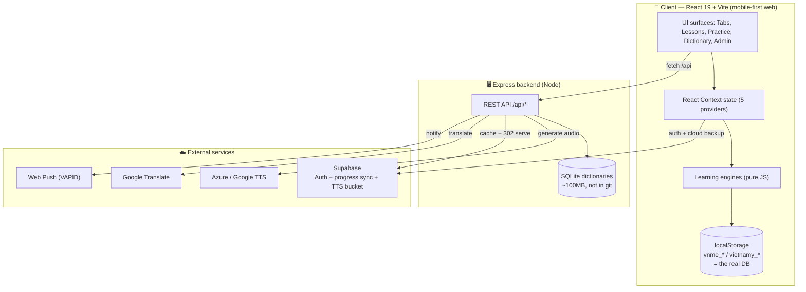

---

## 2. Frontend layers

Five Context providers wrap a single `StudentApp` shell (bottom-nav tabs). Feature surfaces call into `lib/` engines, which read/write `localStorage` and fetch `/api/*`. Routing is one `<Routes>` table in `App.jsx`.

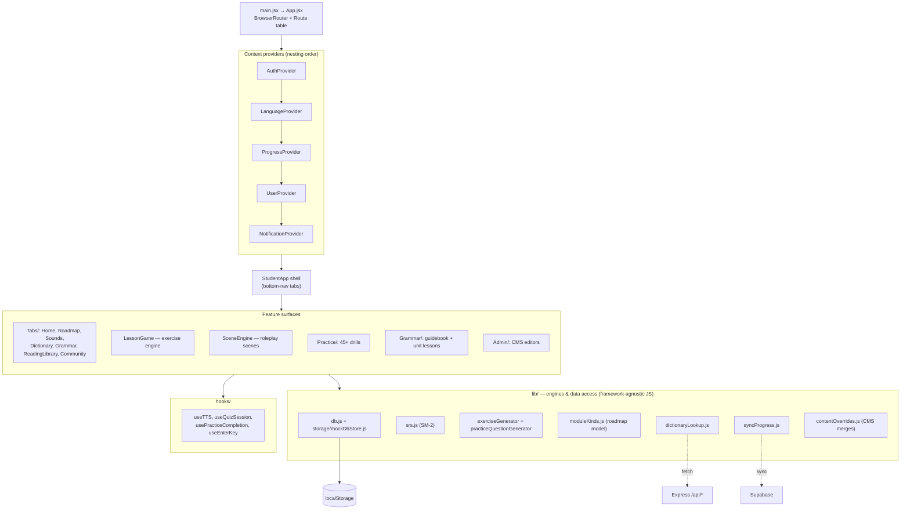

---

## 3. State ↔ storage map

No Redux. Each Context owns its `localStorage` keys. A subset (`SYNC_KEYS`) is what gets backed up to Supabase. **This map is the porting checklist for the storage layer.**

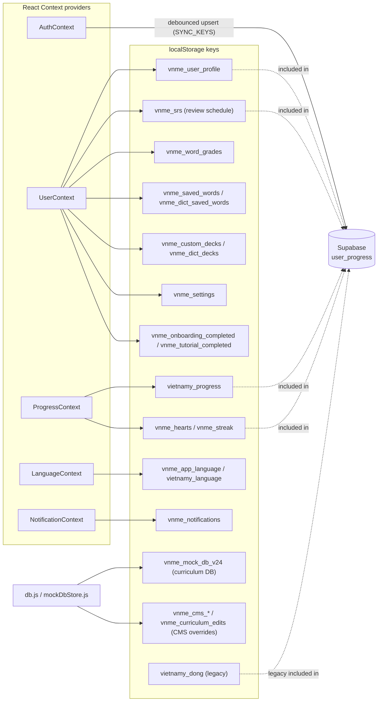

---

## 4. Content pipeline (build-time)

Curriculum is authored as JSON, validated against JSON Schema, then baked into `INIT_DATA` and seeded into `localStorage` on first load. Not fetched at runtime. **Fully portable** — only the final seeding target changes for native.

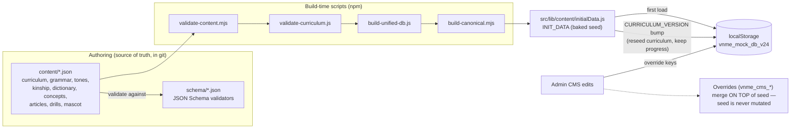

---

## 5. Data model (the mock DB collections)

The `vnme_mock_db_v24` blob holds these collections. Relationships drive the roadmap, lessons, and SRS. Treat this as the schema your native storage must reproduce.

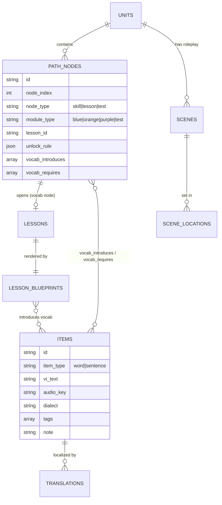

---

## 6. Roadmap node model

The roadmap is a Duolingo-style skill tree. `moduleKinds.js` is the single source of truth for the four module kinds (shape + colour + which editor opens them). Seed, renderer, and admin all derive from it.

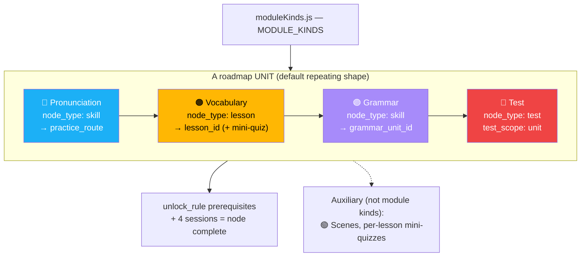

---

## 7. Lesson flow (sequence)

`LessonGame.jsx` generates 10 exercise types from a blueprint, calls the server for audio/scoring, updates gamification, then schedules learned words into SRS and backs up progress.

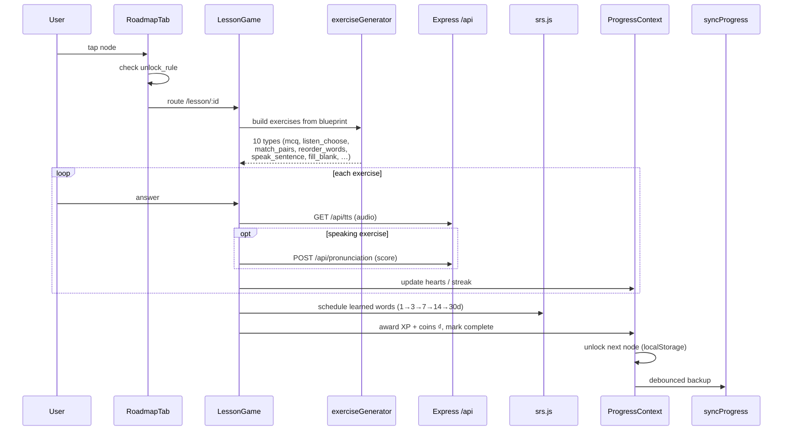

---

## 8. SRS state machine

`srs.js` is SM-2 inspired. Correct recalls promote through five intervals; a lapse resets to day 1. Grades live in `vnme_word_grades`, the schedule in `vnme_srs`.

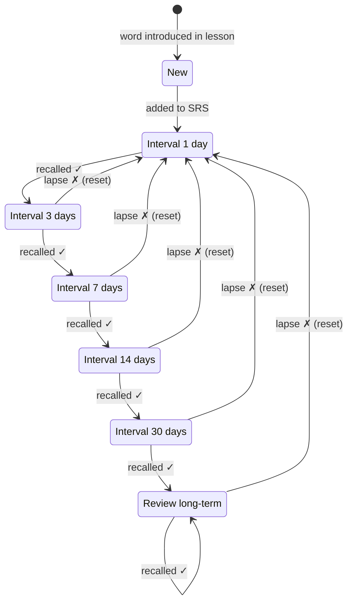

---

## 9. Backend API surface

Small and stateless apart from the SQLite dictionaries. A native app calls the **same REST endpoints** — no server changes. In prod the same process also serves the built web app from `/dist` (ignore that for native).

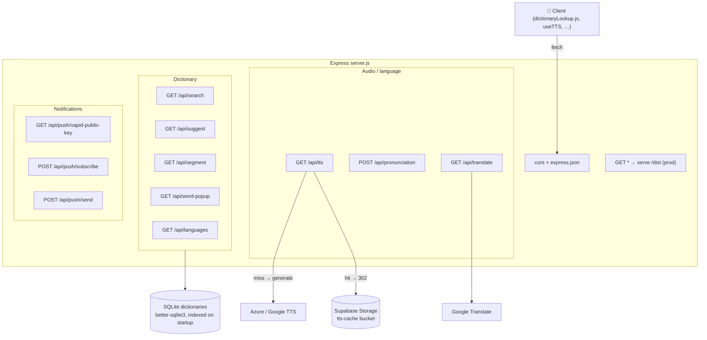

| Endpoint | Purpose | Native port impact |
|----------|---------|-------------------|
| `GET /api/search`, `/suggest`, `/segment`, `/word-popup`, `/languages` | Dictionary | Call as-is |
| `GET /api/tts` | TTS audio, 302 to bucket cache | Call as-is; play natively |
| `POST /api/pronunciation` | Scoring (audio upload) | Replace mic capture with native recorder |
| `GET /api/translate` | Translate proxy | Call as-is |
| `POST /api/push/*` | Web Push (VAPID) | **Replace** with FCM/APNs |

---

## 10. Auth + cloud sync

Supabase auth is optional — with no config the app runs offline as `local-dev`. When signed in, `syncProgress.js` hydrates `localStorage` from `user_progress` on boot and debounce-upserts a `SYNC_KEYS` blob on change.

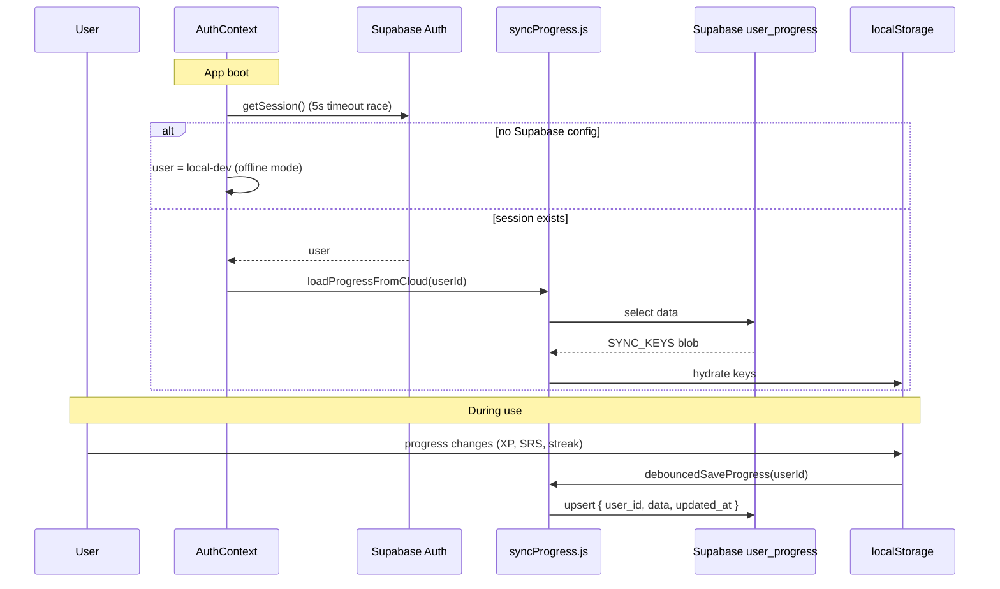

---

## 11. Deployment topology

Dev runs Vite + Express separately (Vite proxies `/api`). Prod builds the frontend into `/dist` and Express serves both API and static. Supabase + TTS are managed.

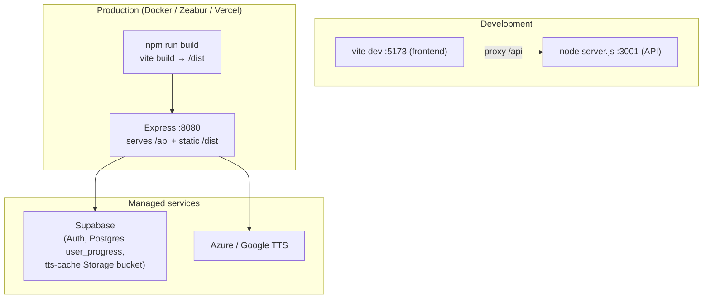

---

## 12. Native port map — the actual work

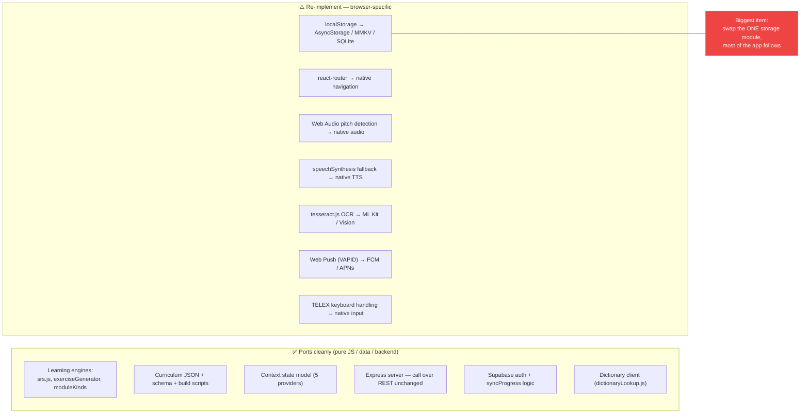

### Suggested porting order

1. Stand up navigation + the tab shell with stub screens.
2. **Replace the storage layer** (`mockDbStore`) with native storage; seed from existing `INIT_DATA`. Unblocks everything stateful.
3. Port the five Context providers (logic reusable; only storage calls change).
4. Wire dictionary + lessons to the existing `/api/*`.
5. Port the engines (`srs`, `exerciseGenerator`, `moduleKinds`) — minimal changes.
6. Re-implement media features last: native audio/TTS, mic pronunciation, OCR, push.

> **Skippable for a v1 native build:** the `/admin/*` CMS (desktop-web content workflow), telex/teencode side-drills, and tone-sample crowd collection. None are on the core learner path.
