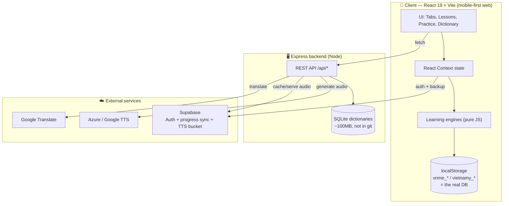
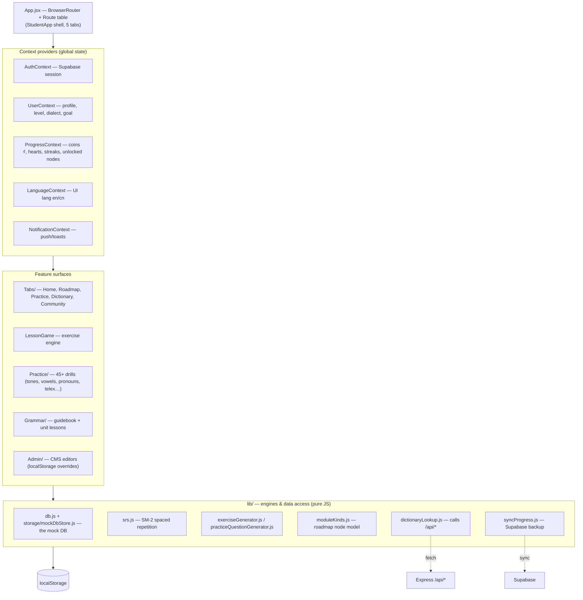
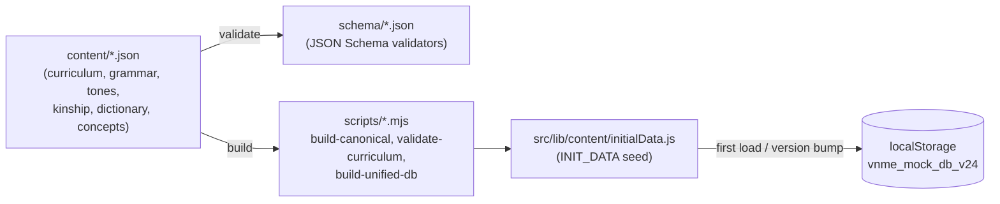
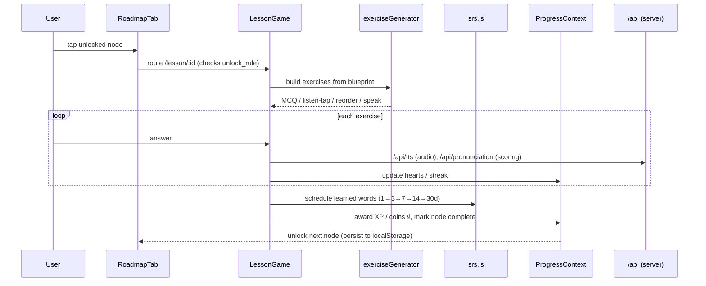
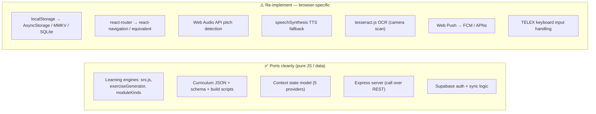

# Vietnamy — Architecture for Mobile Developers (Native Port)

> **Audience:** mobile devs porting Vietnamy to a native / cross-platform app (React Native, Flutter, or Swift/Kotlin).
> **Goal:** a high-level map of how the app works today, and **what is portable vs. what must be re-implemented** for native.
> Renders in Obsidian (Mermaid core plugin), GitHub, and most Markdown tools.

---

## 1. The one thing to understand first

Vietnamy is a **mobile-first React web app** with a **thin Express backend**. There are **no user accounts in the core app logic** — almost all state lives in the browser's `localStorage`. A small "mock database" (`src/lib/db.js`) treats `localStorage` as the production data store. Supabase is bolted on top only for **optional auth + cloud backup** of that local state.

**Implication for a native port:** the hard part is not the UI — it's replacing the **browser-dependent layer** (`localStorage`, `react-router`, Web Audio, `speechSynthesis`, OCR). The learning engines (lessons, SRS, roadmap, dictionary lookup) are **pure JavaScript and port cleanly**. The Express server can stay as-is and be called over REST.

---

## 2. System context

The frontend talks to the backend only for things the browser can't do well: **dictionary search over big SQLite files, TTS audio, pronunciation scoring, and translation**. Everything else (progress, gamification, lesson state) is computed client-side and persisted locally.

---

## 3. Frontend layers

**State management:** React Context + `localStorage`, no Redux. Five providers wrap the app. Each context reads/writes its own `localStorage` keys on change.

**Routing:** `react-router-dom` v6 with one big `<Routes>` table in `App.jsx`. The main app is a single `StudentApp` shell with a 5-tab bottom nav; lessons/practice/grammar/admin are full-screen routes (`/lesson/:id`, `/practice/*`, `/grammar/*`, `/admin/*`).

---

## 4. The data / content pipeline

Curriculum content is **authored as JSON, validated against JSON Schema, then baked into the bundle** as seed data. It is not fetched at runtime.

- `mockDbStore.js` seeds `localStorage` from `INIT_DATA` on first load.
- A `CURRICULUM_VERSION` counter (currently 29) re-seeds curriculum collections on bump **while preserving user progress and edits**.
- The Admin CMS writes **override** keys (`vnme_cms_*`, `vnme_curriculum_edits`) that the engines merge on top of seed data — content edits never touch the seed.

**Port note:** this pipeline is build-time and **fully portable** — the JSON + schema + scripts can ship unchanged. Only the final `localStorage` seeding step needs a native storage target.

---

## 5. A lesson, end to end (typical user journey)

The roadmap is a Duolingo-style skill tree. Nodes have `unlock_rule` prerequisites and four module kinds (Pronunciation 🔵, Vocabulary 🟠, Grammar 🟣, Test 🔴) defined in `moduleKinds.js`. Four sessions complete a node.

---

## 6. Backend API surface

The Express server (`server/server.js`) is small and stateless apart from the SQLite dictionaries. A native app calls the **same REST endpoints** — no changes needed server-side.

| Endpoint | Purpose | Native port impact |
|----------|---------|-------------------|
| `GET /api/search` | Full dictionary search (diacritics, compounds, IPA) | Call as-is |
| `GET /api/suggest` | Fuzzy autocomplete | Call as-is |
| `GET /api/segment` | Word segmentation | Call as-is |
| `GET /api/word-popup` | Word detail card | Call as-is |
| `GET /api/tts` | TTS audio; 302-redirects to Supabase bucket cache | Call as-is; play audio natively |
| `POST /api/pronunciation` | Pronunciation scoring (audio upload) | Replace browser mic capture with native recorder |
| `GET /api/translate` | Google Translate proxy | Call as-is |
| `GET /api/languages` | Available dictionary language pairs | Call as-is |
| `POST /api/push/*` | Web Push (VAPID) subscribe/send/stats | **Replace** with FCM/APNs |
| `POST /api/tone-samples` | Crowd tone-sample collection | Optional |

In production the same server also serves the built web frontend from `/dist`; a native app simply ignores that and hits `/api/*` only.

---

## 7. Portability matrix — the actual porting work

### Replace these (browser-only)

- **Persistence (biggest item).** All app state is `localStorage` under `vnme_*` / `vietnamy_*` keys, accessed through `db.js` + `storage/mockDbStore.js`. Swap this single storage module for native storage (AsyncStorage, MMKV, or SQLite) and most of the app follows. Keys to know: `vnme_mock_db_v24` (curriculum DB), `vietnamy_progress` (completed roadmap/session counts), `vnme_hearts`, `vnme_streak`, `vnme_srs` (review schedule), `vnme_user_profile`, `vnme_word_grades`, `vnme_saved_words`. `vietnamy_dong` is a legacy migration key.
- **Routing.** `react-router-dom` route table → native navigation stack/tabs.
- **Audio & pitch.** Pitch-detection practice uses the Web Audio API; pronunciation uses browser mic capture. Replace with native audio + recording.
- **TTS fallback.** Primary TTS is the server `/api/tts` (keep it). The browser `speechSynthesis` fallback must be replaced with a native TTS engine.
- **OCR.** `tesseract.js` powers camera/image word scanning → native ML Kit / Vision.
- **Push.** Web Push (VAPID, service worker) → FCM/APNs.
- **TELEX typing drills** rely on web keyboard events → native input handling.

### Keep / port directly

- **All learning logic** in `src/lib/` is framework-agnostic JS: SRS scheduling, exercise generation, roadmap unlock rules, grammar/vocab access, dictionary client.
- **Content pipeline** (`content/`, `schema/`, `scripts/`) ships unchanged; only the seeding target changes.
- **The Express backend** is reused verbatim over HTTP.
- **Supabase** auth and the `user_progress` sync table (`syncProgress.js` debounce-upserts the `SYNC_KEYS` blob) port directly via the Supabase native SDK.

---

## 8. Suggested porting order

1. **Stand up navigation + the 5-tab shell** with stub screens.
2. **Replace the storage layer** (`mockDbStore`) with native storage; seed from the existing `INIT_DATA` JSON. This unblocks everything stateful.
3. **Port the Context providers** (Auth, User, Progress, Language, Notification) — logic is reusable; only storage calls change.
4. **Wire the dictionary + lessons to the existing `/api/*`** server.
5. **Port the engines** (`srs`, `exerciseGenerator`, `moduleKinds`) — minimal changes.
6. **Re-implement the media features last**: native audio/TTS, mic-based pronunciation, OCR, push.

> **Skip for v1 if scoping tight:** the `/admin/*` CMS (content editing is a desktop-web workflow), teencode/telex side-drills, and tone-sample crowd collection. None are on the core learner path.
